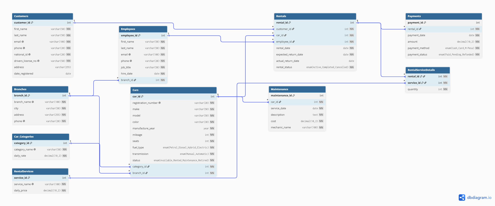

# DriveEase Rentals Database

> This database models **DriveEase Rentals**, a fictional car rental company. It manages customers, branches, employees, vehicles, rentals, payments, vehicle maintenance, and additional rental services while helping the company track rental transactions, monitor vehicle availability, and analyze business operations.

---

## Features

- Relational database design following normalization principles
- 10 interconnected tables
- Primary and composite keys
- One-to-Many and Many-to-Many relationships
- Foreign key constraints and referential integrity
- `ON UPDATE CASCADE`, `ON DELETE CASCADE` and `ON DELETE RESTRICT`
- Unique constraints for important identifiers
- Sample data for testing and analysis
- Basic, cross-table, and advanced DQL queries
- Management-oriented database views

---

## Database Overview

DriveEase Rentals supports the main operations of a car rental company:

- Customer registration
- Branch management
- Employee management
- Vehicle categorization
- Fleet management
- Vehicle rentals
- Payment processing
- Vehicle maintenance history
- Additional rental services

The database is organised into three main SQL layers:

| Layer | Purpose |
|-------|---------|
| DDL | Creates the database structure |
| DML | Populates the database with sample data |
| DQL | Retrieves and analyzes data |

---


## Project Structure

```
car_rental_mysql/
│
├── ddl/
│   └── car_rental_database.sql
│
├── dml/
│   └── car_rental_data.sql
│
├── dql/
│   └── car_rental_queries.sql
│
├── docs/
│   └── DriveEase.png
│
└── README.md
```

---

## Setup & Installation

### Prerequisites

- MySQL Server 8.0 or later
- Git

> [!IMPORTANT]
> The scripts should be executed in the order **DDL → DML → DQL**.

---

### Option 1: Using Visual Studio Code

### Recommended Extensions

- SQLTools
- SQLTools MySQL/MariaDB Driver

### Steps

1. Clone the repository

```bash
git clone https://github.com/Richard3wasonga/car_rental_mysql
```

2. Navigate into the project

```bash
cd car_rental_mysql
```

3. Open the project in Visual Studio Code

```bash
code .
```

4. Connect SQLTools to your MySQL server.

5. Open and execute the DDL script

```
ddl/car_rental_database.sql
```

This creates the `driveease_rentals` database, tables, keys, constraints, and relationships.


6. Open and execute the DML script

```
dml/car_rental_data.sql
```

This populates the database with the sample data.

7. Open and execute the DQL script

```
dql/car_rental_queries.sql
```

Execute individual queries or the entire script to retrieve and analyze the data.

---

### Option 2: Using MySQL Workbench

### Prerequisites

- MySQL Server 8.0 or later
- MySQL Workbench
- Git

### Steps

1. Clone the repository

```bash
git clone https://github.com/Richard3wasonga/car_rental_mysql
```

2. Open MySQL Workbench.

3. Connect to your MySQL server.

4. Open and execute the DDL script

```
ddl/car_rental_database.sql
```

This creates the `driveease_rentals` database, tables, keys, constraints, and relationships.

5. Open and execute the DML script

```
dml/car_rental_data.sql
```

This populates the database with the sample data.

6. Open and execute the DQL script

```
dql/car_rental_queries.sql
```

---

# Database Schema

The database consists of the following 10 tables.

| Table | Description |
|-------|-------------|
| Customers | Stores customer information |
| Branches | Company rental branches |
| Employees | Employees assigned to branches |
| Car_Categories | Vehicle categories and daily rental rates |
| Cars | Vehicle fleet |
| Rentals | Rental transactions |
| Payments | Rental payment records |
| Maintenance | Vehicle servicing history |
| RentalServices | Optional rental services |
| RentalServiceDetails | Junction table linking rentals and services |

---
# Database Relationships

The database includes the following relationships:

| Relationship | Type |
|-------------|------|
| Branches → Employees | One-to-Many |
| Branches → Cars | One-to-Many |
| Car_Categories → Cars | One-to-Many |
| Customers → Rentals | One-to-Many |
| Cars → Rentals | One-to-Many |
| Employees → Rentals | One-to-Many |
| Rentals → Payments | One-to-Many |
| Cars → Maintenance | One-to-Many |
| Rentals ↔ RentalServices | Many-to-Many |


The Many-to-Many relationship between `Rentals` and `RentalServices` is implemented through the `RentalServiceDetails` junction table.

---

# Entity Relationship Diagram

The following Entity Relationship Diagram (ERD) provides a visual representation of the DriveEase Rentals database schema and shows how the tables are connected through primary and foreign keys.



The ERD illustrates the relationships between customers, rentals, vehicles, branches, employees, payments, maintenance records, vehicle categories, and rental services.

---

# DDL — Database Structure

The DDL script:

```text
ddl/car_rental_database.sql
```

defines the structure of the DriveEase Rentals database.

It creates:

* The `driveease_rentals` database
* All 10 tables
* Primary keys
* Composite primary key
* Foreign keys
* Unique constraints
* Check constraints
* Referential actions

### Primary Keys

Major entities use `AUTO_INCREMENT` primary keys.

```sql
customer_id INT AUTO_INCREMENT PRIMARY KEY
```

### Composite Primary Key

`RentalServiceDetails` uses:

```sql
PRIMARY KEY (rental_id, service_id)
```

This prevents the same service from being added more than once to the same rental.

### Referential Integrity

Foreign keys connect related tables and ensure that referenced records exist.

The schema uses:

* `ON UPDATE CASCADE`
* `ON DELETE CASCADE`
* `ON DELETE RESTRICT`

depending on the relationship.

---

# DML — Sample Data

The DML script:

```text
dml/car_rental_data.sql
```

populates the database with sample data representing realistic DriveEase Rentals operations.

The data covers:

* Branches
* Car categories
* Customers
* Employees
* Cars
* Rental services
* Rentals
* Payments
* Maintenance records
* Rental-service selections

The rental data includes different rental states:

| Status      | Meaning                    |
| ----------- | -------------------------- |
| `Completed` | Rental has been completed  |
| `Active`    | Rental is currently active |
| `Cancelled` | Rental was cancelled       |

The sample data also includes different payment methods and statuses, vehicle statuses, maintenance records, and optional rental services.

This provides sufficient data for testing joins, aggregation, grouping, filtering, subqueries, and views.

---

# DQL — Data Retrieval & Analysis

The DQL script:

```text
dql/car_rental_queries.sql
```

contains queries for retrieving and analyzing information from the database.

The queries are divided into three levels.

### Basic Queries

Demonstrate:

* `COUNT`
* `SUM`
* `AVG`
* `GROUP BY`
* `ORDER BY`
* `LIMIT`

Examples include determining the number of maintenance records and total maintenance expenditure.

### Cross-Table / Business Queries

Use joins between related tables to answer practical business questions, including:

* What cars has each customer rented?
* How many rentals has each employee processed?
* What cars belong to each category?
* What cars are available at each branch?
* What is the total payment associated with each rental?
* What additional services were selected for each rental?

### Advanced Queries

Use subqueries, including both scalar and correlated subqueries, together with grouping and aggregation to answer questions such as:

* Which customers made more rentals than the average customer?
* Which cars were rented more times than the average?
* Which branches have more cars than the average branch?
* Which rental had the highest payment?
* Which rental services were selected more times than average?
* Which cars have maintenance costs above the average for that car?

---

# Database Views

The database includes three views designed to provide useful information to DriveEase managers and stakeholders.

### `available_cars_by_branch`

Provides information about vehicles currently available at each branch.

### `branch_rental_performance`

Provides a summary of rental activity and payment information for branches.

### `car_maintenance_summary`

Provides maintenance information for each vehicle, including:

* Number of maintenance records
* Total maintenance cost
* Average maintenance cost

These views simplify commonly required business reports without requiring managers to write complex joins and aggregation queries themselves.


---

## Assumptions & Design Decisions

* Each customer can have multiple rentals, while each rental is linked to one customer and one vehicle, allowing the company to maintain a clear record of who rented which vehicle and when.
* Each vehicle belongs to one branch and one car category so that the company can track where vehicles are located and classify them by rental category and rate.
* A rental can include multiple additional services, and each service can be used across multiple rentals. `RentalServiceDetails` is therefore used as a junction table to represent this many-to-many relationship.
* `RentalServiceDetails` uses a composite primary key (`rental_id`, `service_id`) to prevent the same service from being added more than once to the same rental.
* Maintenance records are linked directly to vehicles because a vehicle can undergo multiple maintenance activities over its lifetime, creating a maintenance history for each vehicle.
* Foreign keys are used to maintain relationships and prevent records from referencing entities that do not exist.
* `ON UPDATE CASCADE`, `ON DELETE CASCADE`, and `ON DELETE RESTRICT` are applied where appropriate to maintain referential integrity while preventing or allowing related records to be removed based on the relationship.
* Sample data was designed to represent different rental, payment, vehicle, and maintenance scenarios so that the database can be meaningfully tested using joins, aggregation, subqueries, and views.

---

## Technologies Used

| Category | Technology |
|----------|------------|
| Database | MySQL 8 |
| SQL Language | DDL, DML and DQL |
| Development Environment | Visual Studio Code / MySQL Workbench |
| Version Control | Git & GitHub |

---

## Team

| Name            | GitHub username     | Role on this project                                                              |
| ----------------| --------------------| --------------------------------------------------------------------------------- |
| Megan Philister | [@username]         | No contribution yet                                                               |
| Joel Ndung'u    | Joexvs              | Employees table and field constraints                                             |
| Nashaa Ndamu    | [@username]         | No contribution yet                                                               |
| Ashley Mwanza   | httpsxash           | Maintenance table, field constraints, seed data and DQL query                     |
| Eric Kabui      | erickabui52-pixel   | No contribution yet                                                               |
| Fred Nyaga      | destroitramon       | No contribution yet                                                               |
| Eric Mwendwa    | Ericmwendwa99-alt   | Cars table, field constraints and seed data                                       |
| Zuwena Kisya    | [@username]         | No contribution yet                                                               |
| Melissa Wanjiru | lisamelly3226-ai    | Payments table and field constraints                                              |
| Andreas Muhavi  | [@username]         | No contribution yet                                                               |
| Richard Wasonga | Richard3wasonga     | DQL (cross-table and advanced queries), views, DML, schema integration and testing|


---

## Contributing

Pull requests are welcome. For significant changes, please open an issue first to discuss the proposed modifications.

---

## License

This project is intended for educational purposes as part of a Car Rental Management System database design assignment.
